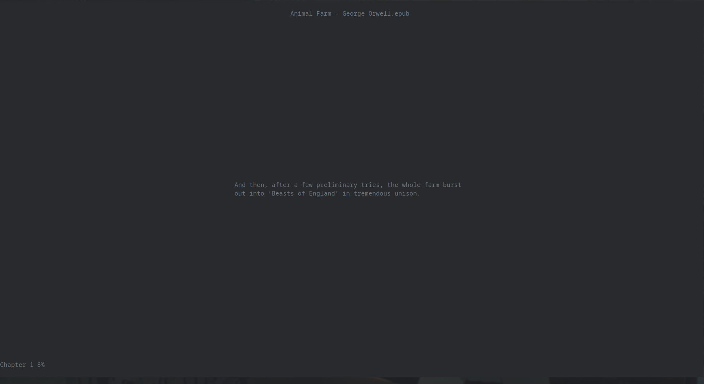

# dynamicreader
A curses CLI PDF/EPUB reader with VI-like bindings that separates sentences for dynamic consumption.



## Usage
Simply download the files in `src` and run `main.py` with the desired parameters. A --help command is available.

### Keybindings
```
j: next line
k: previous line
h: next page/chapter
l: previous page/chapter
g: go to [page/percentage]
tab: open index
s: activate slow printing
x: increase printing speed (slow printing)
z: decrease printing speed (slow printing)
q: quit (autosave progress)
```
